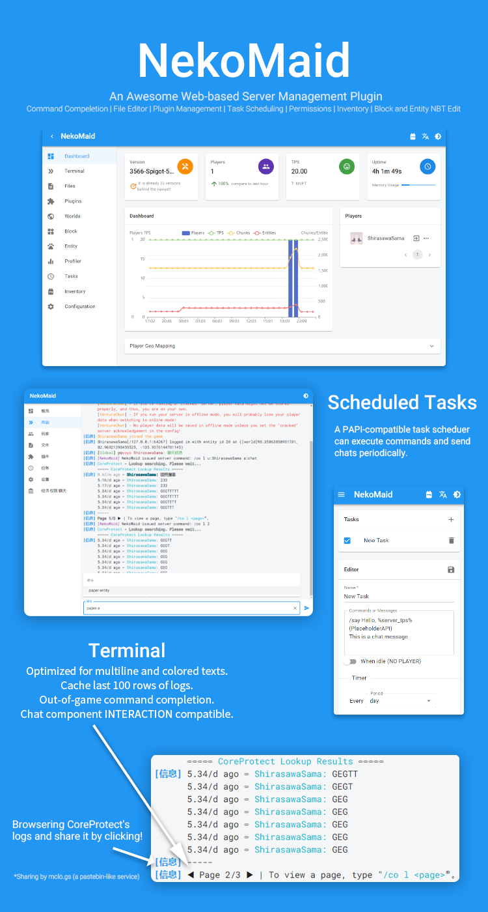
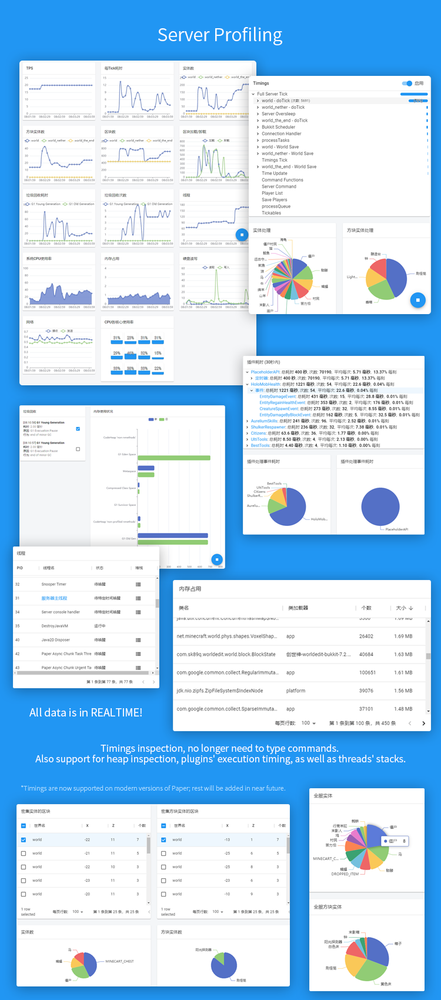
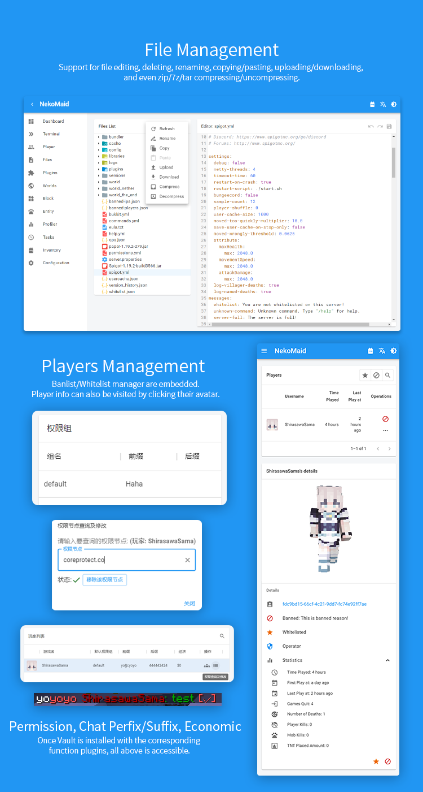
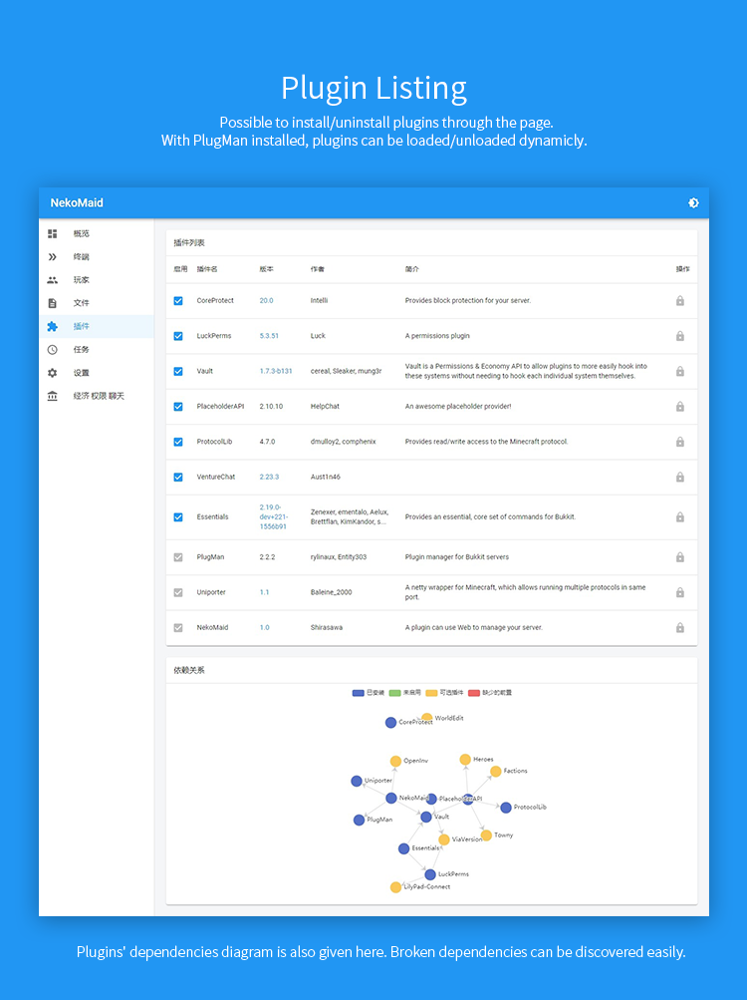
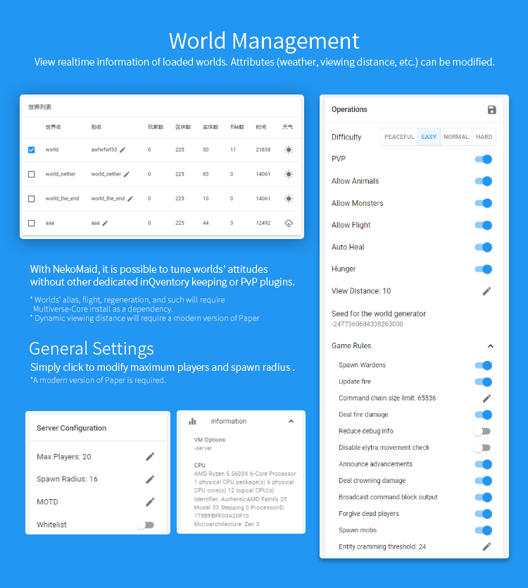
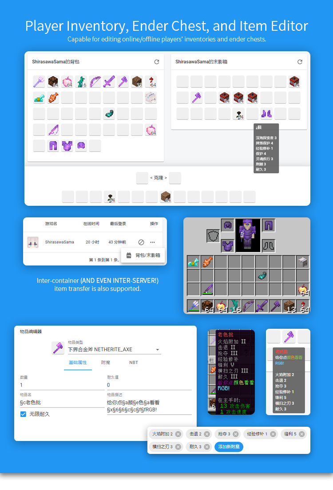
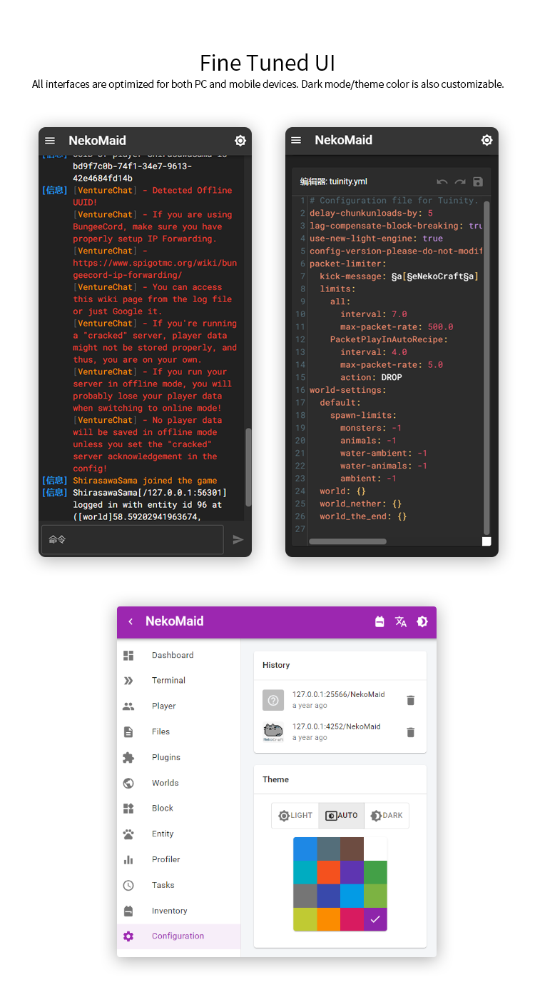

# NekoMaid [](https://github.com/neko-craft/NekoMaid/stargazers) [](https://github.com/neko-craft/NekoMaid/actions/workflows/release.yml) [](https://www.jitpack.io/#neko-craft/NekoMaid)  

A bukkit plugin that can manage your server through web pages.

## Requirements

- [Uniporter](https://github.com/Apisium/Uniporter)

## Usage

1. Download the [NekoMaid.jar](https://github.com/neko-craft/NekoMaid/releases/latest/download/NekoMaid.jar)
2. Put the jar file into the `plugins` folder of your Minecraft server.
3. Restart your Minecraft server.
4. Modify the `hostname` to the address to connect to your MineCraft server.
5. Execute `/nekomaid reload` command in the console to reload configuration.
6. Execute `/nekomaid` or `/nm` command in the console.
7. Open the url and manage your server!

## Commands

- **/nekomaid help**: Get help.
- **/nekomaid temp**: Get a temporary connection address (expires in 15 minutes)
- **/nekomaid reload**: Reload Configuration
- **/nekomaid diagnostic**: Diagnostic the hostname in configuration file.
- **/nekomaid block**: Edit the block you are facing in the web page. (opening the **Block** web page allows you to select the block directly, and also generates a management link)
- **/nekomaid block (WORLD) (X) (Y) (Z)**: Edit the block you are facing in the web page. (opening the **Block** web page allows you to select the block directly, and also generates a management link)
- **/nekomaid invalidate**: Invalidate all previously generated temporary management addresses.
- **/nekomaid entity**: Edit the entity you are facing in the web page. (opening the **Entity** page allows you to directly select the entity directly, and also generates a management link)
- **/nekomaid entity (UUID)**: Edit the entity you are facing in the web page. (opening the **Entity** page allows you to directly select the entity directly, and also generates a management link)

## Configures

```yaml
token: ~ # Password

hostname: 127.0.0.1 # Connecting address of your Minecraft server
customAddress: 'https://example.com/{token}' # Your custom address

geolite2-eula: false # Agree or not with EULA of MaxMind GeoIP2
baidu-map-license-key: '' # If you deploy your own front-end website and turn on the GeoIP function, you should use your own Baidu map license key

skin-url: '' # Custom player skin url (png), {} will be replaced with username or UUID
head-url: '' # Custom player avatar url (png), {} will be replaced with username or UUID

debug: false # Debug mode

logger: # Logger configures
  maxLevel: INFO
  minLevel: OFF
```

## Permission

- **neko.maid.use**: Allow a player to use the `/nekomaid` command.

## For developers

[Wiki](https://github.com/neko-craft/NekoMaid/wiki)

## Screenshot










## License

[MIT](./LICENSE)

## Author

Shirasawa
